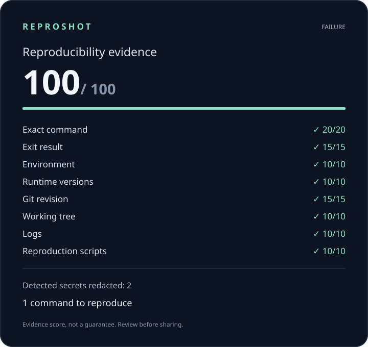

# ReproShot

**Turn any failing command into a reproducible bug report.**

```bash
npx reproshot -- npm test
```



> **Pre-release:** ReproShot is not published to npm yet. Install it from source for now.

ReproShot runs a command, shows its output as usual, and saves the useful debugging context in a local folder. There are no accounts, uploads, or hosted services.

## Try it

ReproShot requires Node.js 20 or newer and works on Windows, Linux, and macOS. Until the first npm release:

```bash
git clone https://github.com/t1ktakdev/ReproShot.git
cd ReproShot
npm ci --ignore-scripts
npm run build
npm link
```

Then use it in the project you want to debug:

```bash
reproshot -- npm test
reproshot -- pnpm build
reproshot -- cargo test
reproshot -- pytest
```

The command runs directly, without an extra shell, so its arguments keep their original boundaries. If you need pipes or other shell syntax, invoke the shell explicitly.

## What you get

Each run creates a folder under `.reproshot/` containing:

```text
report.md
report.html
reproshot.svg
manifest.json
reproduce.sh
reproduce.ps1
stdout.log
stderr.log
changes.patch
SHA256SUMS
```

The reports combine the command, exit status, runtime versions, Git state, redacted logs, and reproduction helpers. `changes.patch` is included when there are eligible tracked text changes. Source code and dependencies are not copied into the bundle.

Open `report.html` for the full report or share `reproshot.svg` as a compact summary. To replay the command, restore the recorded source revision, install the project dependencies, and run the appropriate helper from the project directory. Review any patch before applying it.

The Repro Score describes how much useful evidence was captured. It is not a promise that the bug will reproduce.

To turn a capture into a GitHub issue body:

```bash
reproshot issue                         # latest capture in this project
reproshot issue .reproshot/<capture-id> # a specific capture
```

This prints Markdown for you to review and paste; it never posts anything to GitHub. For scripts and CI, add `--json` before `--` to get a machine-readable summary.

## Before sharing

ReproShot redacts detected secrets, but no redactor can catch everything. Review the report before sharing it. Live terminal output is unchanged, including any secrets printed by the command.

ReproShot does not read `.env` files, SSH keys, credential stores, browser data, or unrelated files. Untracked file contents are not included. Add `.reproshot/` to your `.gitignore` if you use it regularly.

See the [capture contract](docs/capture-contract.md) for the exact collection rules, limits, process behavior, exit codes, and Repro Score calculation.

## Development

```bash
npm run check
npm run demo
```

The SVG above is generated from the committed demo capture. The examples intentionally fail so the full capture path can be tested.

[Contributing](CONTRIBUTING.md) · [Security](SECURITY.md) · [Release procedure](docs/releasing.md) · [MIT license](LICENSE)
